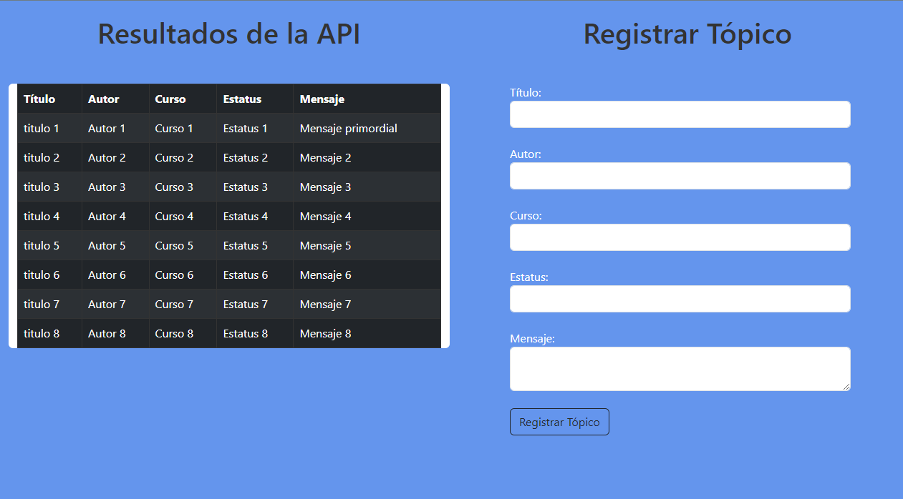

#  Challenge Back End API REST

## Introducción 
API Centrada en tópicos, permite a los usuarios:
* Crear un nuevo tópico
* Mostrar todos los tópicos creados
* Mostrar un tópico específico
* Actualizar un tópico
* Eliminar un tópico
## Tecnologías utilizadas

* Spring boot 3
* Java 17 
* Mysql
* HTML/CSS
* Javascript 
  
## Pequeño fronted 

## Registro de nuevo topico

# Descripción de los Endpoints API
## Obtener un Tópico por su ID
### Endpoint: /topico/{id}

Método HTTP: GET

Descripción: Este endpoint permite obtener un tópico específico mediante su ID. Proporciona detalles completos sobre el tópico identificado por el parámetro id en la URL.

## Listar Tópicos Paginados
### Endpoint: /topico

Método HTTP: GET

Descripción: Este endpoint devuelve una lista paginada de todos los tópicos disponibles. Utiliza parámetros de paginación para controlar la cantidad de resultados por página.

## Agregar un Nuevo Tópico
### Endpoint: /topico

Método HTTP: POST

Descripción: Este endpoint permite agregar un nuevo tópico a la colección. Debes proporcionar datos válidos en el cuerpo de la solicitud en formato JSON para crear un nuevo tópico.

## Actualizar un Tópico Existente
### Endpoint: /topico/{id}

Método HTTP: PUT

Descripción: Este endpoint te permite actualizar un tópico existente identificado por su ID. Debes proporcionar los datos actualizados en el cuerpo de la solicitud en formato JSON.

## Eliminar un Tópico por su ID
### Endpoint: /topico/{id}

Método HTTP: DELETE

Descripción: Este endpoint permite eliminar un tópico específico mediante su ID. Una vez eliminado, el tópico no estará disponible en la colección.

