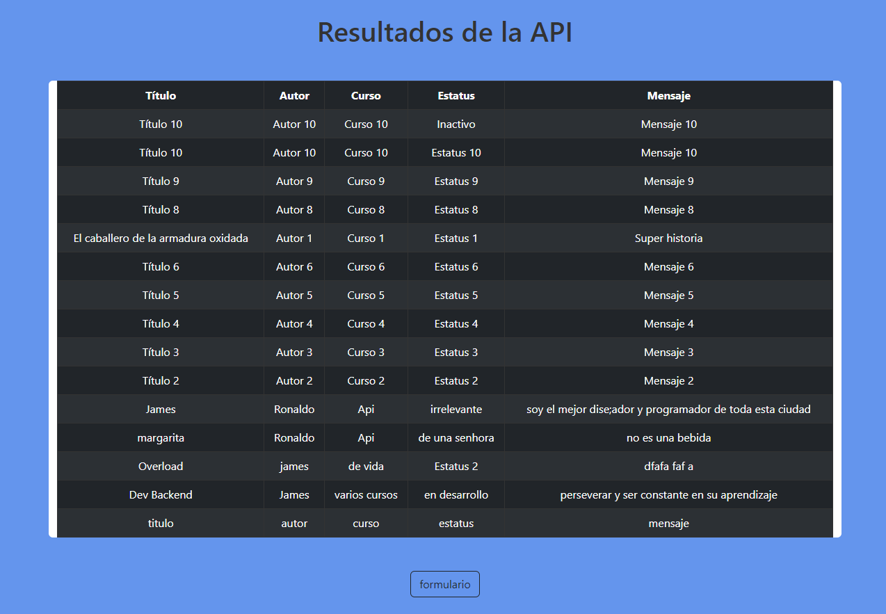

#  Challenge Back End API REST

## Introducción 
API Centrada en tópicos, permite a los usuarios:
* Crear un nuevo tópico
* Mostrar todos los tópicos creados
* Mostrar un tópico específico
* Actualizar un tópico
* Eliminar un tópico
## Tecnologías utilizadas

* Spring boot 3
* Java 17 
* Mysql
* HTML/CSS
* Javascript 
  
## pequeño fronted 

